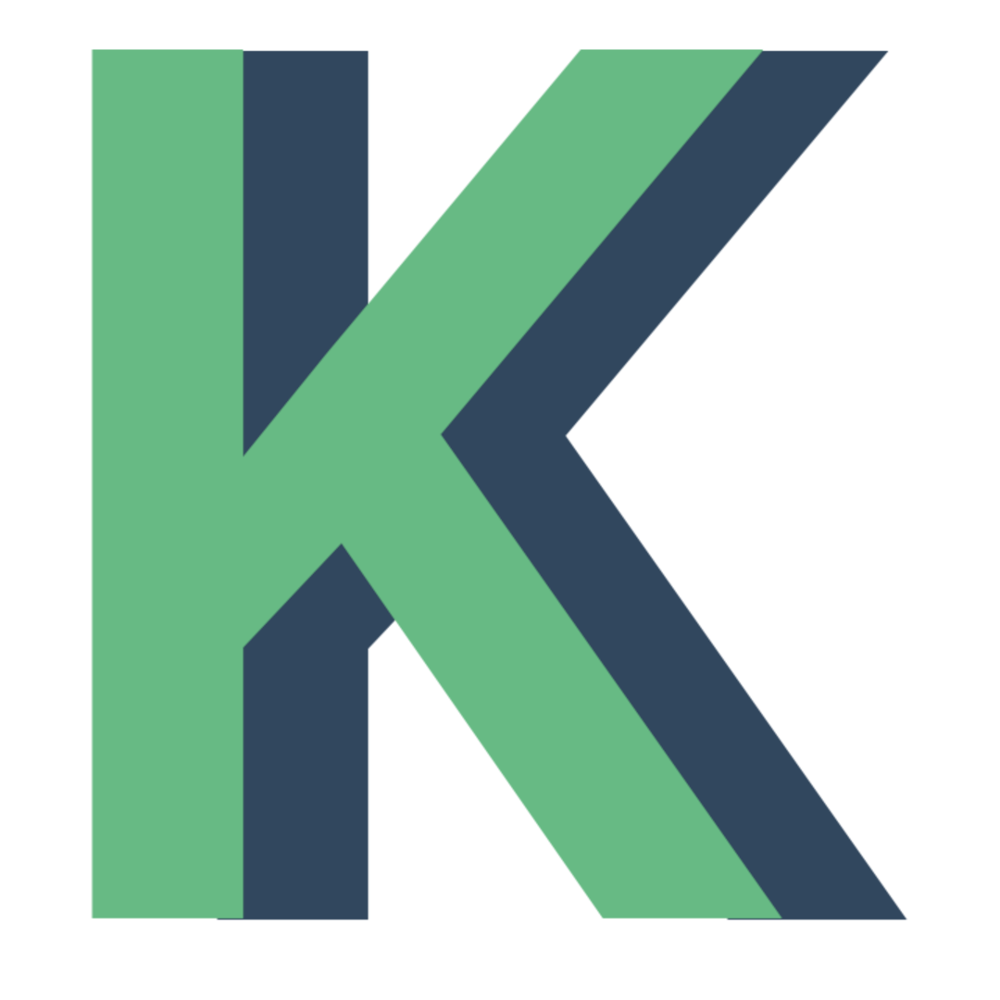

<p align="center">
    <br>
</p>
<h1 align="center">Kapseli UI Framework</h1>


[](https://www.npmjs.com/package/@stingydev/kapseli)

A UI Framework for creating a SPA dashboard application.

## Features

### Low Level API
Kapseli enables its low-level api to modify and extend. It has large scale Event-Listen-Network. You can use and listen all events thanks of this API.

### Extendible Structure
Thanks of Low Level API of Kapseli, you can extend, even overwrite, its core functionality.

### Various UI Packages
Aren't you designer? Don't worry. Our plugin repository is rich. There are premium and free packages. If you want complicated and easy to use components, try premium packages. We will continue release new UI packages. Be patient.

### Auto Form AJAX
Kapseli has a connection with its storage manager to store form data automatically when the form is submitted. With this feature, collect data is pie.

### Built-in Route System
Kapseli has built-in auto init router. Only register your pages. Routing is the task of Kapseli. Don't worry!

### Customizable HTML Render Engine
Kapseli has its own HTML Render Engine. No dependency! This engine is powered by Event-Listen-Network of Kapseli. You can customize it by using this network and the loew level API.


## To install
```bash
npm i @stingydev/kapseli
```

## Sponsors 


## Support

<a href="https://www.buymeacoffee.com/stingydev" target="_blank"></a>

